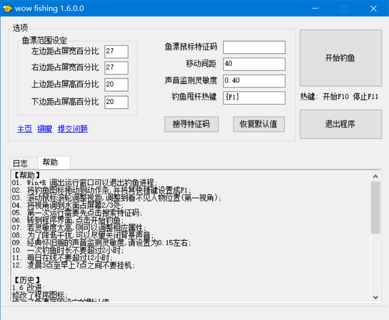
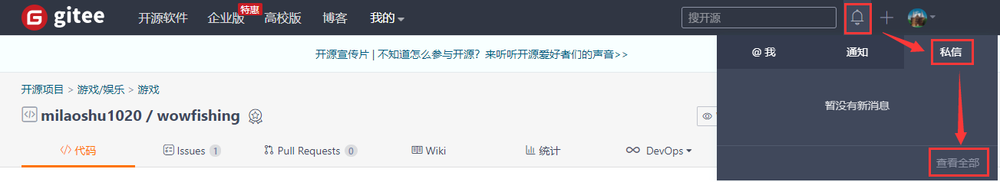

# wowfishing

#### 介绍
魔兽世界的自动钓鱼程序,支持正式服和经典怀旧服;

#### 软件界面

#### 下载地址

* 在这里捐赠本项目的用户将在**3分钟内**收到包含最新版下载地址的私信;

* 如何查看私信:

* 有问题,比如没收到下载地址,不会使用等...可以私信或者留言联系我;

如果运行不了请下载 .Net Framework 4.0 并安装:

* [.Net Framework 4.0 下载地址](https://www.microsoft.com/zh-cn/download/details.aspx?id=17718);

#### VBX脚本的使用

* 运行脚本需要系统已经安装了 [NScript](https://gitee.com/milaoshu1020/NScript)([下载地址](https://gitee.com/milaoshu1020/NScript/releases));
* 安装完毕以后,双击VBX脚本即可运行;
* 打开任务管理器,结束"wnscript.exe"进程可以终止脚本运行;
* 你可以用记事本或者其他编辑器查看甚至编辑VBX文件;

#### 常见问题

* [点击查看](https://gitee.com/milaoshu1020/wowfishing/wikis/)
